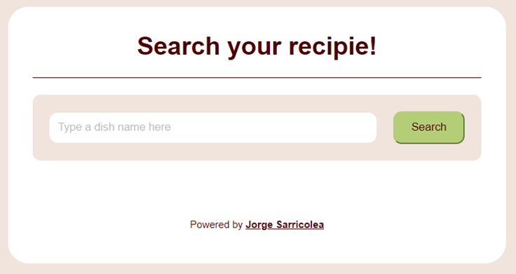

# [Recipies-NET](https://jorgesarricolea.com/recipies-net)
This is a recipe search engine obtained through the MealDB API, it has a nice and responsive UI, and you can complement it with the [Calorie Calculator](https://jorgesarricolea.com/calorie-calculator) I made.

## Description
It's not just about UI/UX design, but also about knowing what to do with the data on the Back-End side. In this project, I have used the free API from [MealDB](https://www.themealdb.com/api.php). You will find an image of the dish you're looking for, a list of ingredients, and step-by-step instructions on how to cook the dish. You can use it on your mobile device or computer.

### Some images:

